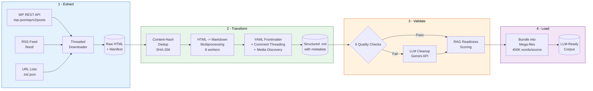
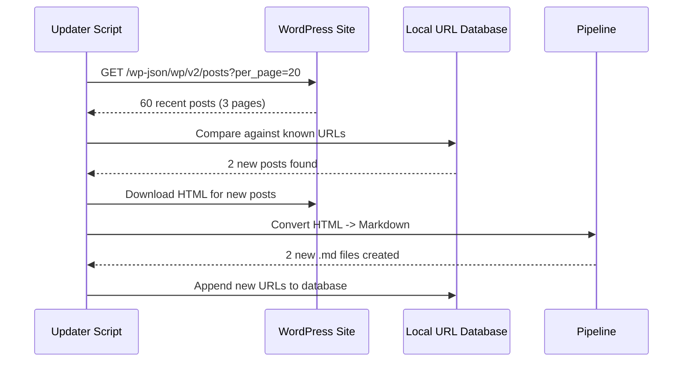

# WordPress to RAG Pipeline

[](https://python.org)
[](https://www.crummy.com/software/BeautifulSoup/)
[](https://fastapi.tiangolo.com/)
[](https://ai.google.dev/)
[](LICENSE)

**A production ETL pipeline that turns WordPress sites into RAG-ready Markdown -- 20,000+ pages, 18.5M words, fully automated.**

Extracts content via the WP REST API, strips 88% HTML boilerplate, deduplicates with content hashing, preserves threaded comment structures, and bundles everything for LLM consumption. Handles non-Latin scripts (Hebrew, Arabic, CJK) including RTL encoding, OCR cleanup, and percent-encoded URL slugs.

---

> Built and battle-tested on two live Hebrew WordPress archives totaling 20K+ pages. This repo contains the generalized pipeline scripts and architecture -- no proprietary content included.

---

## Architecture



### Incremental Update Flow



## The Problem This Solves

WordPress blogs accumulate years of structured knowledge: Q&A threads, articles with nested comment discussions, PDF attachments, audio/video references. But this content is:

- **88% boilerplate** -- nav, sidebar, footer, ads, scripts, social buttons
- **Scattered** across thousands of pages with no bulk export
- **Full of duplicates** -- same content at multiple URLs (query params, encoded slugs, trailing slashes)
- **Encoding minefield** -- non-Latin scripts hit RTL rendering, Windows path limits, console encoding, URL percent-encoding as separate bug classes
- **Unusable by LLMs** in raw HTML form

This pipeline solves all of that.

## Key Results

| Metric | Value |
|--------|-------|
| Pages processed | **20,000+** |
| Q&A threads extracted | **17,700+** |
| Articles with comments | **1,700+** |
| Duplicate groups caught | **1,900+** |
| HTML boilerplate stripped | **88%** |
| Final corpus | **~18.5M words** |
| Media assets discovered | **200+ PDFs, audio, video** |

## Design Decisions

<details>
<summary><strong>Why WP REST API instead of Scrapy/Crawl4AI?</strong></summary>

WordPress ships a REST API at `/wp-json/wp/v2/posts` that returns structured JSON with pagination, field selection, and filtering. Using it first is faster, more polite, and more reliable than HTML crawling. The pipeline falls back to RSS, then HTML scraping, in that order.
</details>

<details>
<summary><strong>Why content-hash dedup instead of URL dedup?</strong></summary>

The same article often lives at multiple URLs: with/without `fbclid`, encoded vs decoded Hebrew slugs, trailing slash variations. SHA-256 on normalized text catches all of these. This approach found 1,900+ duplicate groups across 20K files that URL comparison would have missed.
</details>

<details>
<summary><strong>Why multiprocessing for conversion but threading for download?</strong></summary>

Downloads are I/O-bound (network wait) -- threading with 10 workers is ideal. HTML parsing with BeautifulSoup is CPU-bound -- multiprocessing with 8 workers gives near-linear speedup across 18K files.
</details>

<details>
<summary><strong>Why LLM cleanup as a separate stage?</strong></summary>

OCR-garbled PDFs (Identity-H font encoding) can't be fixed with regex. Gemini Flash handles this at ~7K word chunks with quality gates. But it's expensive -- so automated RAG-readiness scoring runs first, and only files that fail go to the LLM. This cut API costs by 90%.
</details>

<details>
<summary><strong>Why bundle into mega-files?</strong></summary>

NotebookLM and similar tools have per-source word limits (~500K). Concatenating related .md files with clear separators uploads an entire corpus as a handful of sources while preserving document boundaries for chunking.
</details>

## Pipeline Stages

### Stage 1: Source Discovery & Monitoring

Polls WordPress sites for new content via WP REST API with RSS fallback. Runs as a one-shot updater or a persistent polling server with HTTP API and webhook notifications.

| Script | Description |
|--------|-------------|
| `wp_content_updater.py` | One-shot: detect new posts -> download -> convert to .md |
| `wp_content_monitor.py` | Polling server with FastAPI endpoints + webhook support |

**Monitor endpoints:** `GET /posts/new`, `GET /comments/new`, `GET /status`, `POST /check-now`, `POST /mark-seen`

### Stage 2: Download (Extract)

Threaded downloader with retry logic (exponential backoff on 429/5xx), rate limiting, robots.txt compliance, content-type validation, size limits, and a full manifest for resume support.

| Script | Description |
|--------|-------------|
| `html_downloader.py` | Bulk download -- 10 concurrent workers, checkpoint every 100 |

Features: per-thread sessions, streaming with size cap, ETag/Last-Modified tracking, categorized error reports.

### Stage 3: Deduplication

Content-hash dedup (SHA-256 on normalized text) with a two-step safety workflow: detect -> review manifest -> confirm deletion.

| Script | Description |
|--------|-------------|
| `detect_duplicates.py` | Scan + group duplicates, output review manifest |
| `delete_duplicates.py` | Execute deletion with `--confirm` flag (dry-run by default) |

### Stage 4: Transform (HTML -> Markdown)

The core conversion: strips boilerplate, extracts structured metadata, preserves WordPress comment threading with depth/nesting, author roles (site team vs commenter), and reply-to chains.

| Script | Description |
|--------|-------------|
| `convert_html_to_md.py` | Multiprocessing converter -- 8 workers, YAML frontmatter, media discovery |

**Output format:**
```yaml
---
title: "Article Title"
author: "Author Name"
date: "2024-01-15"
tags: [philosophy, ethics]
source: https://example.com/post-slug/
referenced_pdfs: ["document.pdf"]
---
# Article Title

Article body content...

## Comments

---
**[Site Team] Author Name** | 2024-01-16

Response to the article...

  ---
  **Commenter** (reply to Author Name) | 2024-01-17

  Follow-up question...
```

Four output templates handle different WordPress page types:

| Template | Content Type |
|----------|-------------|
| `qa_template.md` | Q&A (question + author answer + follow-up) |
| `article_template.md` | Articles (body + threaded comments) |
| `blog_post_template.md` | Blog posts with nested comment threads |
| `book_chapter_template.md` | Book content with chapter structure |

### Stage 5: Validation

Six automated checks run across the full corpus before loading:

| Check | What it catches |
|-------|----------------|
| `frontmatter` | Missing/malformed YAML metadata |
| `qa_completeness` | Q&A files missing question or answer sections |
| `article_completeness` | Articles with empty bodies or missing comments |
| `html_vs_md` | HTML files that failed to convert |
| `subscription_leaks` | Paywall/subscription text that leaked through |
| `word_counts` | Outliers -- suspiciously short or bloated files |

| Script | Description |
|--------|-------------|
| `validate_batch.py` | Batch validator -- `--check all` or individual, with `--sample N` |
| `assess_rag_readiness.py` | Composite scoring: structure density, paragraph quality, encoding, chunkability |

### Stage 6: Load (Bundle for LLM)

Concatenates .md files into mega-files respecting per-source word limits, with document separators and an upload manifest.

| Script | Description |
|--------|-------------|
| `prepare_llm_sources.py` | Bundle .md into mega-files (configurable word limit, default 450K) |

## Getting Started

### Prerequisites

- Python 3.10+
- A WordPress site with REST API enabled (most have it by default)

### Installation

```bash
git clone https://github.com/Seithx/wordpress-to-rag-pipeline.git
cd wordpress-to-rag-pipeline
pip install -r requirements.txt
```

### Quick Start: Full Pipeline

```bash
# 1. Prepare a URL list (JSON: {"category": ["url1", "url2", ...]})
#    Or use the updater to discover URLs automatically (step 1b)

# 1b. Discover and download new content from a WordPress site
python scripts/wp_content_updater.py --site https://your-wp-site.com --output project/ --dry-run
python scripts/wp_content_updater.py --site https://your-wp-site.com --output project/

# 2. Bulk download from URL list
python scripts/html_downloader.py --urls urls.json --output html_raw/

# 3. Deduplicate
python scripts/detect_duplicates.py --input html_raw/ --report dupes.json
# Review dupes.json, then:
python scripts/delete_duplicates.py --manifest dupes.json --confirm

# 4. Convert to Markdown
python scripts/convert_html_to_md.py --input html_raw/ --output md_output/ --all --workers 8

# 5. Validate
python scripts/validate_batch.py --check all --md-dir md_output/ --html-dir html_raw/

# 6. Assess RAG readiness
python scripts/assess_rag_readiness.py --input md_output/

# 7. Bundle for LLM
python scripts/prepare_llm_sources.py --input md_output/ --output bundled/ --max-words 450000
```

### Quick Start: Incremental Updates

```bash
# Check for new posts (dry run)
python scripts/wp_content_updater.py --site https://your-wp-site.com --output project/ --dry-run

# Download and convert new posts
python scripts/wp_content_updater.py --site https://your-wp-site.com --output project/

# Or run the monitor server for continuous polling
python scripts/wp_content_monitor.py --site https://your-wp-site.com --port 8400 --interval 300
```

## Project Structure

```
scripts/
  html_downloader.py         # Stage 2: Threaded bulk download with manifest
  detect_duplicates.py       # Stage 3: Content-hash duplicate detection
  delete_duplicates.py       # Stage 3: Safe deletion with dry-run
  convert_html_to_md.py      # Stage 4: Multiprocessing HTML->MD conversion
  validate_batch.py          # Stage 5: 6-type batch validation
  assess_rag_readiness.py    # Stage 5: RAG quality scoring
  prepare_llm_sources.py     # Stage 6: Bundle into mega-files
  wp_content_updater.py      # Stage 1: One-shot incremental updater
  wp_content_monitor.py      # Stage 1: Polling server with HTTP API

templates/                   # Output format templates per content type
examples/                    # Sanitized sample output
requirements.txt
```

## Tech Stack

| Tool | Role |
|------|------|
| **Python 3.13** | Pipeline language |
| **BeautifulSoup4** | HTML parsing and content extraction |
| **html2text** | HTML-to-Markdown base conversion |
| **requests + urllib3** | HTTP client with retry/exponential backoff |
| **feedparser** | RSS/Atom feed parsing |
| **multiprocessing** | Parallel HTML->MD conversion (8 workers) |
| **concurrent.futures** | Threaded downloads (10 workers) |
| **hashlib (SHA-256, BLAKE2)** | Content deduplication |
| **FastAPI + uvicorn** | Monitor polling server HTTP API |
| **Gemini API** | LLM-based OCR cleanup for garbled content |
| **tqdm** | Progress tracking |

## What I Learned

- **WordPress REST API is underused.** Most scraping tutorials jump straight to Scrapy or Selenium. The WP REST API (`/wp-json/wp/v2/posts`) gives you structured data, pagination, and field selection out of the box. Use it first.

- **Dedup before transform, not after.** Hashing raw HTML content is cheap. Converting 2,000 duplicate files to Markdown and then diffing them is not. Running dedup early in the pipeline saved hours of processing time.

- **Non-Latin text is a cross-cutting concern.** RTL rendering in terminals, Windows path encoding limits, console charmap errors on Hebrew output, percent-encoded URL slugs that need matching in both forms -- each of these is a separate bug class. I had to handle all of them.

- **LLM cleanup is a scalpel, not a bulldozer.** Automated quality scoring (structure density, garbled character ratio, paragraph distribution) identifies the 10% of files that actually need LLM intervention. Running everything through Gemini would have cost 10x more with no quality gain.

- **Resume-safety is non-negotiable at scale.** Every script in this pipeline checkpoints its progress to disk. A 20,000-page download interrupted at page 15,000 restarts at 15,001 -- not page 1. This saved me dozens of hours over the course of the project.

## Author

**Made by [Asaf Lecht](https://www.linkedin.com/in/asaflecht/)**

- **LinkedIn:** [linkedin.com/in/asaflecht](https://www.linkedin.com/in/asaflecht/)
- **Email:** asaflecht@gmail.com
- **Bug Reports:** Create an issue or email above

Connect with me for questions, suggestions, or to discuss data pipelines and non-Latin content processing!

## License

MIT
